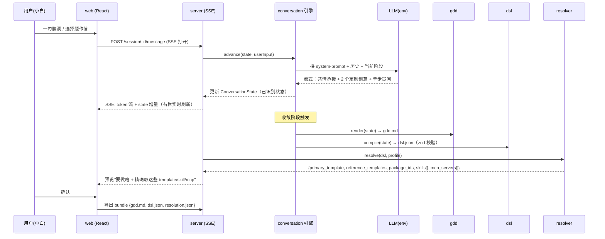

# chat-questioner 设计方案

> 日期：2026-06-02 · 状态：**待用户审阅** · 类型：设计文档（spec）
> 关联：[`00-NewBee提问策略参考集.md`](./00-NewBee提问策略参考集.md)（原始素材）、[`../prompts/newbee.system.md`](../prompts/newbee.system.md)（系统提示词）
> 上游事实源（forgeax-studio）：`docs/workbench-1.0/references/universal_gdd_template.md`、`packages/game_templates/spec/gameplay_template_registration_schema.md`、`docs/SKILL_CLASSIFICATION_2026-06-01.md`、`docs/MCP_CLASSIFICATION_2026-06-01.md`

---

## 1. 背景与目标

### 1.1 问题
forgeax-studio 现状：用户在 Launch 页填一句大白话 `prompt` → `/api/local-init {game_id, prompt}` → agentic_os 的 Kubee 编排。其中：

- **没有一个真正"陪小白把游戏想清楚"的环节**：workbench 的 "Phase 0" 只问一个问题就进 pillar/coding；classic 靠 `pack-search` 子 agent 现场搜模板。小白说不清自己要什么，产出质量靠运气。
- **运行时上下文有"全量加载税"**：skill（51 个）与 MCP（18 个平台 server）按 profile **扁平白名单全量注册**，与该游戏是否会用到无关；classic 还要现场跑 `pack-search` 搜索 + 读生命周期文档——这就是"**搜索/读文档阶段的时间损耗**"。

### 1.2 目标（两条价值线）
1. **做出好游戏**：一段深挖的创意导演式引导对话，把小白从"我好像想做点什么"带到"我有一个完整且有灵魂的游戏概念"，产出覆盖游戏制作各方面的 **GDD**。
2. **精确、零搜索地执行**：把对话结论翻译成一份 **DSL**，让（下一轮接入的）agentic_os 能据此**精确取到** template/skill/mcp，短路 `pack-search`、按需门控 skill/MCP，砍掉搜索/读文档损耗。

### 1.3 非目标（本项目不解决）
- 不替换 agentic_os 的下游 pillar/design/production/coding 流程；只在**它之前**加一段。
- 不做素材生成、不做鉴权/多用户/云端持久化。

---

## 2. 范围与边界（本轮 milestone）

| 纳入本轮 | 推迟到下一轮（已在 §7 定契约） |
|---|---|
| 独立 TS 应用：对话 web + server(SSE) | agentic_os 运行时**活接线**（真正消费 DSL、短路 pack-search、门控 skill/MCP） |
| NewBee 对话引擎（合成 5 份策略） | 鉴权、多用户、云端持久化 |
| 富 GDD 产出（`gdd.md`） | 素材（图/音/3D）生成 |
| 选择 DSL（`dsl.json`）+ 校验 | |
| 解析器：DSL → {template,skills,mcp}，对 forgeax **真实目录离线跑通** | |
| 交接 bundle 导出 + 交接契约**定义** | |

---

## 3. 关键决策记录（来自需求澄清）

| # | 决策 | 选择 | 理由 |
|---|---|---|---|
| D1 | 运行形态 | **独立前置应用**（与 agentic_os 解耦） | 目录平级摆放；独立部署迭代；不挤占 agentic_os 上下文预算 |
| D2 | 技术栈 | **全 TypeScript**（Vite+React / Node-Fastify / SSE） | 与 forgeax 同生态，DSL↔目录绑定最顺、最不易错 |
| D3 | 集成深度（本轮） | **应用 + 离线解析器**；活接线下轮 | 高价值的"精确选择"假设可独立验证，又不必本轮动 agentic_os 会话装配 |
| D4 | 对话深度 | **深挖创意导演式 5 阶段**，但每步走 V2 单步收敛 | 旅程深、有魂；每步仍是低门槛选择题，不淹没小白 |
| D5 | 输出形态 | **双层：富 GDD（人看）+ 派生选择 DSL（机器读）** | 关注点分离；DSL 1:1 落在现有目录词汇上，可版本化、可离线测 |
| D6 | LLM | **LiteLLM Proxy（OpenAI 兼容）**，`https://llm-proxy.forgeax.com/v1`，密钥走 env | 与 forgeax 同一代理；OpenAI 兼容客户端即可，不绑死单一 SDK |
| D7 | DSL 受控词汇 | **枚举 + 自由词回退**：`genre/mechanics/art_style` 优先匹配已知枚举，未命中的自由词回退进 `intent_terms` | 鲁棒——既有结构化匹配，又不丢失小白的原话信号 |
| D8 | catalog 索引 | **构建期生成**（读 forgeax 真实目录产出 `catalog-index.json`），可选提交快照 | 永远新；快照仅作离线/CI 兜底 |

---

## 4. 总体架构

pnpm + TypeScript monorepo，置于 `chat-questioner/`，6 个单一职责单元：

```text
chat-questioner/
├── apps/
│   ├── web/            # Vite+React 对话 UI：左对话流，右"实时 GDD 草稿 + 已识别状态"可视化
│   └── server/         # Fastify + SSE；对话编排；LLM provider(env)；GDD→DSL 编译
├── packages/
│   ├── conversation/   # NewBee 引擎：阶段机 + 单步收敛 + 动态投喂 + 透镜 + 宪法纪律 + ConversationState
│   ├── gdd/            # GDD 模型 + markdown 渲染（扩展现有 Game Brief 10 节）
│   ├── dsl/            # 选择 DSL：TS 类型 + JSON Schema + zod 校验（versioned）
│   └── resolver/       # catalog 适配器/索引器 + resolve()：DSL → {template,skills,mcp}
├── prompts/           # newbee.system.md（系统提示词，可拆 fragment）
└── docs/              # 00-参考集、01-设计方案(本文)
```

**依赖方向**（单向，避免环）：`web → server → {conversation, gdd, dsl, resolver}`；`conversation → {gdd, dsl}`；`resolver → dsl`；`gdd → dsl`（仅类型）。`dsl` 是最底层、纯类型与校验，谁都可依赖。

---

## 5. 数据流



---

## 6. 组件设计

### 6.1 对话引擎（`packages/conversation`）
把 5 份策略合成**一台阶段机**，每一步走 V2 的"单步"协议。

**阶段机**（融合 V1 四阶段 + V5 五阶段）：

| 阶段 | 后台目标 | 喂给 ConversationState 的字段 |
|---|---|---|
| 0 破冰 Hook | 极低门槛引子，无术语 | — |
| 1 火花 Spark | 发散找兴奋点（回忆游戏/影视/现实/幻想） | spark, references[] |
| 2 核心体验 + 四元素 | 情绪锚点 / 核心动作 / 世界观角色 / 视听 | coreEmotion, coreFantasy, coreAction, theme, aesthetic |
| 3 核心循环 | 初见杀 / 驱动力奖励 / 边界惩罚 | loop{30s,5m,30m,long}, reward, failRule |
| 4 美学多巴胺 Juice | 高光时刻 / 手感隐喻 | juice[], gameFeel |
| 5 世界与叙事 | 世界规则/阵营/冲突/历史/美术/音乐 | world, narrative |
| 6 平衡心流 | 难度爬坡 / 重玩价值 | difficultyCurve, replayMotivation |
| 7 收敛 Synthesis | Pitch / 关键词池 / 差异化 / 参考 / 风险 / MVP | pitch, keywordPools{6类}, differentiator, risks[], mvpScope |

**每轮协议（V2）**：① 共情承接（复述潜台词、放大爽点）→ ② 动态投喂 2 个**当前题材定制**创意 → ③ 单步收敛提问（选择题/填空题）。

**透镜（V5/Schell）**：引擎带透镜清单（情感/好奇/风险/奖励/幻想/身份/社交/故事/意义），在阶段 2–6 主动切入追问。

**纪律（V3/V4）**：MVP 优先、主动裁剪、暴露风险；锁定**游戏宪法**（核心幻想/核心循环/美术规则/数值规则/内容边界/技术边界/世界观/UI）防 50 轮漂移。

**ConversationState**：贯穿全程的结构化状态（V5"持续维护已识别内容"），是 GDD 与 DSL 共同的事实源。引擎在每轮把 LLM 抽取的字段并入 state；阶段推进是"必填字段已齐"的函数，不是死板线性。

**系统提示词**：见 `prompts/newbee.system.md`，用 fragment 思路组织（身份/原则/每轮协议/阶段清单/透镜/宪法/输出契约），便于维护与中英双版。

### 6.2 GDD 输出（`packages/gdd`）
以现有 `universal_gdd_template.md`（Game Brief 10 节：What / How / Win·Lose / Content / Assets / Tech Plan / Cost / MVP / Risk / AI Summary）为底座，补充深挖产物：

- 一句话 Pitch、核心幻想、核心体验
- 四级循环（30s / 5min / 30min / 长线）
- 六类关键词池（玩法 / 情绪 / 世界观 / 视觉 / 叙事 / 玩家动机）
- 情绪曲线、差异化亮点、参考作品（借鉴/避免）
- **游戏宪法**（不可漂移项清单）

`gdd.md` 由 `render(state)` 生成，既给用户确认，也作为 DSL 的回指源（`constitution_ref`）。

### 6.3 选择 DSL（`packages/dsl`）
唯一使命：把对话结论变成 agentic_os 能精确取目录的信号。字段刻意落在 forgeax 现有词汇上。

```jsonc
{
  "schema_version": "0.1",
  "constraints": {
    "platform": ["PC"],              // "PC" | "mobile" | "web"
    "dimension": "2D",               // "2D" | "3D"
    "engine": "pixijs",              // "pixijs" | "threejs" | "phaser" | "canvas" | "dom"
    "networking": "singleplayer",    // "singleplayer" | "multiplayer"
    "orientation": "Portrait"        // "Landscape" | "Portrait"
  },
  "genre": "merge-puzzle",
  "mechanics": ["drag-connect", "score-combo"],
  "art_style": "watercolor-cozy",
  "modalities": ["image", "audio", "ui"],   // 驱动 skill/MCP 分层门控
  "intent_terms": ["猫咪", "解压", "连连看"],   // 喂模板匹配（对齐 template.yml intent_terms）
  "signature_terms": ["踩奶节奏", "呼噜治愈"],
  "mvp_scope": { "must": ["核心连接循环", "计分"], "cut": ["关卡系统"] },
  "constitution_ref": "gdd.md#游戏宪法"
}
```

- 校验：zod（运行时）+ JSON Schema（跨语言/文档）双轨，二者由同一 TS 源生成，避免漂移。
- `constraints` 字段与 `gameplay_template_registration_schema.md` 的 `primary_constraints` / `primary_features` 一一对应——这是"精确选模板"的关键。
- `modalities` 是 skill/MCP 门控的主开关（见 §6.4 分层规则）。
- **受控词汇策略（D7）：枚举 + 自由词回退**。`genre` / `mechanics` / `art_style` 各维护一份**已知枚举表**（`dsl/vocab/*.ts`，初值取自 forgeax 现有词汇：UI matrix 7 genre、narrative 26 specialist、template intent/signature 词、art tags）。编译 DSL 时：能命中枚举的归入结构化字段；命中不了的小白原话**回退进 `intent_terms`**，绝不丢弃。这样既能结构化匹配，又保留原始信号喂给模板加权匹配。

### 6.4 解析器（`packages/resolver`）——本项目的"精确选择"证明

**(a) catalog 适配器 + 索引器**：只读 forgeax-studio 事实源，预编译成一份 **catalog 索引 JSON**：

| 来源 | 路径 | 抽取 |
|---|---|---|
| 玩法模板 | `packages/game_templates/templates/gameplay/**/template.yml` | id, desc, primary_constraints, intent_terms, signature_terms, mobile-support |
| 基础模板 | `templates/{basic,basic-cn}/{pixijs-2d,threejs-3d}` | engine, dimension |
| 可安装包 | `packages/game_templates/package-registry/**` | 包 id ↔ skill |
| Skill | `packages/marketplace/src/skills/**` + `src/plugins/*/skills/**` 的 `SKILL.md` frontmatter | name, description, tags, 分层(查 SKILL_CLASSIFICATION) |
| MCP | `packages/vag_mcp/deploy/mcp-services.json` + `profiles/*.yaml` 的 `mcpServers` | server, 功能域, 分层(查 MCP_CLASSIFICATION) |
| Profile | `packages/marketplace/profiles/*.yaml` | 白名单口径（classic / workbench / *_cn） |

> forgeax-studio 路径通过 env `FORGEAX_ROOT` 注入（默认 `../forgeax-studio`），适配器只读不写。索引器**在构建期生成**（D8）`resolver/catalog-index.json`（`pnpm build:catalog`），保证永远与 forgeax 真实目录同步；可选提交一份快照仅作离线/CI 兜底。**预编译这一步本身就对冲了运行时"搜索/读文档"的时间损耗。**

**(b) `resolve(dsl, profile)` → ResolutionResult（v0.2，富结构 + 扁平投影双视图）**

设计为**面向 agentic_os 整体改造前向兼容**（详见 §7.1）：一份**规范富结构（canonical）**承载"无损 / agent 不介入 / 渐进式按需加载"所需的全部元数据，一份**扁平投影（`install_packs`）**从富结构派生、供近期零改造直喂 `install_packs`。

```jsonc
{
  "schema_version": "0.2",
  "profile": "workbench",
  "template": {
    "primary": "match3-candy",
    "references": ["link-match"],
    "basis": { "matched_terms": ["连连看", "消除"], "constraints": { "dimension": "2D", "engine": "pixijs" } }
  },
  "skills": [
    { "id": "H_2D_LookMaster", "layer": "L0", "phase": "production", "load": "eager", "trigger": "dimension:2D" },
    { "id": "game-audio",      "layer": "L0", "phase": "production", "load": "eager", "trigger": "modality:audio" },
    { "id": "2D_ai_pixel_generation", "layer": "L2", "phase": "production", "load": "gated", "trigger": "art_style:pixel" }
  ],
  "mcp": [
    { "server": "as-mate-tools", "layer": "L0", "phase": "boot",       "load": "eager", "tools": ["install_packs", "workflow_step"] },
    { "server": "image-gemini",  "layer": "L1", "phase": "production", "load": "eager", "trigger": "modality:image" },
    { "server": "music-search",  "layer": "L1", "phase": "production", "load": "eager", "trigger": "modality:audio" }
  ],
  "packages": [
    { "id": "kubee-client-contract", "load": "eager", "trigger": "foundation" },
    { "id": "bgm-lifecycle",         "load": "eager", "trigger": "modality:audio" }
  ],
  "unmatched": [],   // 没映射到任何目录的 DSL 信号 —— 证明"无损"：没有被悄悄丢弃的信号
  "warnings": [],

  "install_packs": {  // ← 从上面派生的扁平投影，近期零改造直喂 install_packs + profile 白名单口径
    "primary_template": "match3-candy",
    "reference_templates": ["link-match"],
    "package_ids": ["kubee-client-contract", "bgm-lifecycle"]
  }
}
```

**每个条目携带的渐进式加载元数据**（语义对齐两份分类报告）：

| 字段 | 取值 | 服务于 |
|---|---|---|
| `layer` | skill `L0`–`L3` / mcp `L0`–`L5`（见 SKILL/MCP_CLASSIFICATION） | 渐进式分层加载主轴 |
| `phase` | `boot`（引导期）/ `production`（生产期）/ `coding`（编码期） | 何时加载 |
| `load` | `eager`（常驻）/ `gated`（按 `trigger` 条件门控）/ `lazy`（被点名才拉） | 加载纪律 |
| `trigger` | 触发它的 DSL 信号（如 `modality:image` / `dimension:2D` / `foundation`） | **无损可追溯** + 加载器复核条件 |
| `mcp[].tools` | 工具级白名单（可选） | 落地 MCP 报告 P0 的 wire 层**工具级**过滤 |
| `unmatched` | 没命中的 DSL 信号 | 无损的另一半：显式记录而非静默丢弃 |

**选择规则**：

- **template**（填 `template.primary/references/basis`）：`dimension`+`engine` 硬门控（2D/3D 不混用，对齐 pack-search 协议）；`is_mobile`(platform 含 mobile) 与 `mobile-support:false` 模板互斥 → 候选集；再用 `intent_terms`/`signature_terms` 与 DSL 同名字段做加权匹配选 primary + references，命中词记入 `basis.matched_terms`。无命中 → 回退 `basic[-cn]/{pixijs-2d|threejs-3d}` 并 `warnings` 告警（对齐 workbench 行为）。
- **skills**：⚠ **`pack-search` 不进 resolution**——解析器本身就是它的离线替代（已经把模板选好了），这正是"省时"的来源。除它之外的 L0 常驻核心**恒选**（`load:eager`；LookMaster/game-audio/optimizer/cover 等，见 SKILL_CLASSIFICATION L0）；L1/L2/L3 按 `modalities`+`genre`+`mechanics` 选入并标 `load:gated`+`trigger`（如 `3D`→H-3d-LookMaster/ScaleNormalizer；`pixel`∈art_style→2D 像素簇；`tower-defense`∈genre→towerdefense-tower）。
- **mcp**：L0(`as-mate-tools`,`phase:boot`)+L1 热核按需(`phase:production`)；L2/L3 按 `modalities` 加挂并标 `gated`+`trigger`（`image`→image-gemini/postprocess；`audio`→music-search/vertex；`3d`→asset3d-search；`pixel`→pixelart-pipeline；`sidescroller`→sidescroller-pipeline）。zero-call/清理区项不选。可选填 `tools` 做工具级裁剪。
- **packages / install_packs 投影**：`packages[]` 收集 foundation + 各 trigger 命中的可安装包；`install_packs` 块由 `template` + `packages[]` 直接派生。

**(c) 离线 golden 测试**：样例 DSL（猫咪连连看 / 赛博朋克送快递 3D / 弹幕 STG / 塔防 …）对**真实 forgeax 目录**跑，断言完整 ResolutionResult（含 `layer/phase/load/trigger` 与 `install_packs` 投影一致性）。这是本轮最该被验证的高价值假设。

### 6.5 web（`apps/web`）
Vite + React。左侧对话流（SSE 流式渲染），右侧"实时 GDD 草稿 + 已识别状态"面板（随 ConversationState 增量刷新，类似"对话小猫"把过程可视化）。收敛后展示 resolution 预览 + 一键导出 bundle。

### 6.6 server（`apps/server`）
Fastify。职责：会话生命周期、SSE 端点、LLM 客户端、调用 conversation 引擎、收敛时调 gdd/dsl/resolver、导出 bundle。会话状态本地文件持久化（可续）。

**LLM 接入（D6）**：统一走 **LiteLLM Proxy（OpenAI 兼容）**，用任意 OpenAI 兼容客户端（如 `openai` npm 包，`baseURL` 指向代理）即可，无需多 provider 抽象。全部参数走 env：

```bash
LLM_BASE_URL=https://llm-proxy.forgeax.com/v1   # LiteLLM Proxy
LLM_API_KEY=sk-***                              # 仅放 .env，永不入库（见 .gitignore）
LLM_MODEL=gemini-3.1-pro                         # 默认，见 §11
```

密钥仅存于 `chat-questioner/.env`（gitignore 保护），`.env.example` 只放占位符。

---

## 7. 与 agentic_os 的交接契约（本轮**定义**，下轮接线）

现状入口：`/api/local-init {game_id, prompt}`（见 `docker/local-dev-routes.mjs`）。

**交接 bundle**（本轮导出）：`{ gdd.md, dsl.json, resolution.json }`。

**未来接法（下轮三选一，已预留）**：
1. **prompt 携带**：把 dsl.json 序列化进 `/api/local-init` 的 `prompt`（最小改造，agentic_os 侧解析）。
2. **文件落盘**：把 `dsl.json` 写入 game 目录，agentic_os 启动时读取。
3. **新端点**：`/api/local-init` 增 `dsl` 字段或新增 `/api/init-from-dsl`。

**下轮 agentic_os 改造点（仅记录，不在本轮实现）**：用 resolution 短路 classic 的 `pack-search` 子 agent；按 resolution 的 skills/mcp 做 per-session 门控加载（落地 SKILL/MCP 分类报告里的 L0–L3 / L0–L5 分层）。因 ResolutionResult 同时给出 `install_packs` 扁平投影与富结构，改造量可大可小（见 §7.1）。

### 7.1 面向 agentic_os「整体改造」的前向兼容

本设计要**保留用 DSL 整体改造 agentic_os 的可能性**——即未来用一套**无损、agent 不介入**的确定性选择，替换掉现在 `pack-search` 子 agent 现场"抓药方"的逻辑，并支持**渐进式按需加载**新的 skill/mcp。为此 ResolutionResult 刻意做成**双视图**，让两条演进路径都不堵死：

| 接入档位 | 消费 ResolutionResult 的哪部分 | agentic_os 改造量 | 收益 |
|---|---|---|---|
| **档位 1 · 零改造** | 仅 `install_packs` 扁平投影 | 几乎为 0（喂现有 `install_packs`） | 先把"对话产出"接进来，验证端到端 |
| **档位 2 · 短路抓药方** | `template` + `packages` + 扁平投影 | 小（classic 跳过 `pack-search` spawn，直接装） | 砍掉搜索/读文档的时间损耗 |
| **档位 3 · 渐进式分层加载（整体改造）** | 富结构 `skills[]` / `mcp[]` 的 `layer/phase/load/trigger/tools` | 中（按层/阶段/触发条件的运行时门控加载器） | 把扁平白名单全量注册改成按需渐进加载，落地两份分类报告的 L0–L5 治理 |

**为什么富结构能支撑"无损 / agent 不介入 / 渐进式"**：

- **无损**：每个被选项都带 `trigger`（回溯到具体 DSL 信号），未命中的信号进 `unmatched`——选择全程可追溯、无静默丢弃，不需要 agent 再做模糊判断（取代 `Unknown skill` 模糊匹配那类 agent 介入）。
- **agent 不介入**：resolver 是纯函数式确定性映射，输出即"加载计划"，agentic_os 直接执行，无需 spawn 搜索子 agent。
- **渐进式按需**：`layer`+`phase`+`load` 让加载器先上 `eager`/L0、进入相应 `phase` 再上 L1/L2、`lazy`/L3 等被 `skill()` 或工具调用点名才拉；**未来新增 skill/mcp 需求 = resolver 多吐一条带 `layer/phase/trigger` 的条目，输出 schema 不变**（`schema_version` 仅在不兼容时升版）。
- **工具级粒度**：`mcp[].tools` 预留了 wire 层工具级过滤（MCP 报告 P0），整体改造时可从 server 级收紧到 tool 级，不必改字段名。

> 命名结论：原扁平 `mcp_servers` 已升级为 `mcp`（条目带 `server`+可选 `tools`），`skills`/`packages` 由字符串数组升级为带元数据对象数组，并新增 `trigger`/`layer`/`phase`/`load`/`unmatched` 与输出层 `schema_version`——既满足近期零改造（投影），又为整体改造与渐进式加载留足扩展位。

---

## 8. 错误处理

| 场景 | 处理 |
|---|---|
| LLM 调用失败/超时 | SSE 发 `error` 事件；ConversationState 已落盘，可续聊 |
| LLM 输出不含可抽取字段 | 引擎不推进阶段，本轮按协议**回环补问**，绝不吐半截 state |
| DSL 必填字段缺失 | `compile` 前 zod 校验失败 → 引擎回到对应阶段补问，**绝不导出半截 DSL** |
| 模板无命中硬约束 | 回退 basic 模板 + `warnings`，不静默 |
| catalog 索引与源漂移 | 索引器构建期对 schema 校验；resolver 遇未知 term 进 `warnings` 而非崩溃 |
| `FORGEAX_ROOT` 不存在 | 启动期快速失败并给出明确提示 |

---

## 9. 测试策略

- **resolver golden（最高价值）**：样例 DSL × 真实 forgeax 目录 → 断言 ResolutionResult。
- **dsl 校验**：合法/非法样例的 zod + JSON Schema 一致性。
- **conversation 剧本回放**：喂罐装用户答案，断言阶段推进、ConversationState、最终 gdd.md / dsl.json（参考"对话小猫"replay 思路）。
- **gdd 渲染**：state → markdown 快照测试。
- **server SSE**：连通性 + error 事件冒烟。

---

## 10. 里程碑（建议交付顺序）

1. **M0 契约层**：`packages/dsl`（DSL 类型+schema+校验）+ **ResolutionResult v0.2 类型/schema（富结构 + `install_packs` 投影）** + GDD 模型 + 交接 bundle 形状。← 最先锁死接缝
2. **M1 解析器**：catalog 适配器/索引器 + `resolve()`（产出富结构 + 派生投影，标 `layer/phase/load/trigger`）+ golden 测试（对真实目录，断言富结构与投影一致）。← 验证"精确选择"
3. **M2 对话引擎**：阶段机 + 每轮协议 + ConversationState + 系统提示词接入 + 剧本回放。
4. **M3 应用壳**：server(SSE) + web(对话/可视化/导出)，端到端打通。

> M0+M1 完成即可独立证明本项目最硬的假设（DSL→精确目录），不依赖 UI。

---

## 11. 开放问题

**已解决（2026-06-02）：**
- ✅ DSL 受控词汇 → **枚举 + 自由词回退到 `intent_terms`**（D7）。
- ✅ catalog 索引 → **构建期生成** + 可选快照（D8）。
- ✅ LLM → **LiteLLM Proxy（OpenAI 兼容）**，`LLM_BASE_URL=https://llm-proxy.forgeax.com/v1`，密钥走 `.env`（D6）。

- ✅ `LLM_MODEL` → 默认 **`gemini-3.1-pro`**（已在代理 `/v1/models` 核实可用；策略原文即 Gemini 3.1 调校，行为最贴合）。备选：`deepseek-v4-pro` / `gemini-3.5-flash`（更省）/ `claude-opus-4-8`（更强）。

- ✅ 系统提示词语言 → **本轮仅中文**（`prompts/newbee.system.md` 已就绪）；英文版以后需要时再补。

**仍待定：** 无。所有开放问题已收口，spec 可进入实施计划。

---

## 附录 A · 与 forgeax-studio 词汇映射速查

| DSL 字段 | forgeax 对应 | 用途 |
|---|---|---|
| `constraints.{platform,dimension,engine,networking}` | `primary_constraints`（模板 schema） | 硬选模板 |
| `constraints.orientation` | `primary_features.screen_orientation` | 软选模板 |
| `intent_terms` / `signature_terms` | 同名（`template.yml`） | 模板加权匹配 |
| `modalities` | SKILL/MCP 分层触发维度 | 门控 skill/mcp |
| `genre` / `mechanics` | UI matrix genre / 玩法关键词 / narrative specialist | 门控专项 skill |
| 解析输出 `install_packs` 投影 | `install_packs({primary_template,reference_templates,package_ids})` + profile 白名单 | 下轮零改造接入（档位 1/2） |
| 解析输出 `skills[]`/`mcp[]` 的 `layer/phase/load/trigger/tools` | SKILL `L0–L3` / MCP `L0–L5` 分层 + 引导/生产/编码阶段 + wire 层工具级过滤 | 渐进式按需加载（档位 3，整体改造） |
