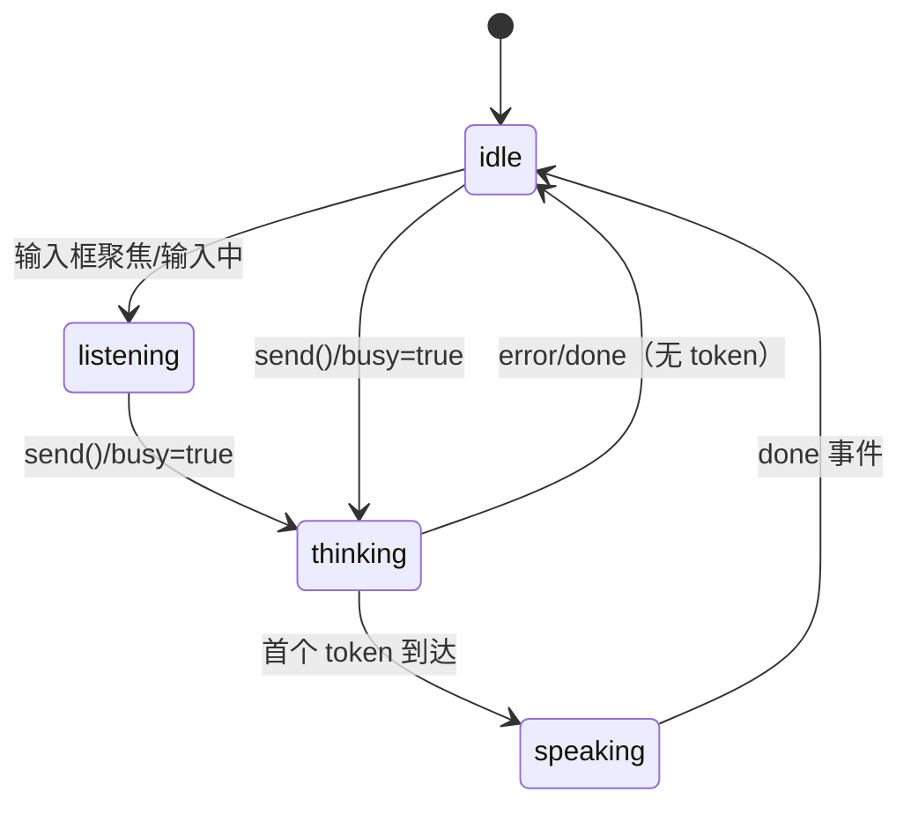

# chat-questioner 前端形象 · 状态机方案（NewBee Avatar）

> 日期：2026-06-03 · 状态：**待用户审阅** · 类型：设计 + 开发方案（spec）
> 关联：[`01-设计方案.md`](./01-设计方案.md)（主设计 / SSE 事件 / ConversationState）、[`05-设计方案-v3v4-profiles.md`](./05-设计方案-v3v4-profiles.md)（profile 化）、`../prompts/newbee*.system.md`（每轮协议与 state_delta 字段）
> 素材源：`../../Visual-State-Machine/mov/`（~100 个 emoji 动画母版）
> 下游事实源（forgeax-studio）：agentic_os / Kubee 生命周期（boot / production / coding）、`install_packs`、resolver 输出的 skills/mcp 分层

---

## 0. 实现状态（2026-06-03）

A0–A3 已落地并全绿（116 测试 / typecheck / web build 通过）：

- **A0 资产管线**：`packages/avatar/scripts/build-avatar-assets.ts` + `assets/rename-map.csv`（23 原语）；`pnpm build:avatar` 已产出 `apps/web/public/avatar/*.{webm,mov,png}` + `manifest.json`（webm 全部 <300KB）。
- **A1 FSM 内核**：`packages/avatar`（`states/signals/machine/diffState/manifest`）+ 23 单测。
- **A2 适配**：`apps/web/src/avatar/{derive,useAvatar}.ts`，从 `useSession` 响应式输出派生信号（零改 SSE 网络层；仅给 `useSession` 加了 `warnTick` 浮出原先被丢弃的 `warning` 事件）。
- **A3 舞台**：`Avatar.tsx` + `Stage/BubbleColumn/DetailsDrawer` + `App.tsx` 重构 + styles；vite/vitest/tsconfig 以 alias 指向 `@cq/avatar` 源码。
- **A4 forgeax 下游**（`handoff/building/build-success/build-fail`）：FSM 与素材已就位，等 forgeax 暴露生命周期后接 `BuildSignalSource`（§7.4）。

---

## 1. 背景与定位

chat-questioner 的核心体验是「一段会**实时反应**的创意共创对话」：左侧 NewBee 流式说话，右侧实时刷新「已识别状态 + GDD 草稿」。但目前这套反应是**纯文本**的——用户感受不到 NewBee 的「人格」和「情绪」。

本方案给 NewBee 一个**会动的前端形象**：用一台**有限状态机（FSM）**，把大模型流式输出过程中、以及对话/构建生命周期里的**特定语义事件**，映射成形象的**具体表演**（一段 emoji 动画）。

**两条硬性约束（来自需求）**：

1. **状态必须与功能强关联**：每个状态都对应 chat-questioner 的某个真实信号（流式 token、识别到某类字段、阶段推进、收敛、纪律动作如裁剪/暴露风险/锁宪法、告警/出错），或 forgeax-studio 下游的构建生命周期。不做「为动而动」的装饰。
2. **形象与素材解耦**：当前用提供的 emoji 母版**子集**占位；后续会自研 IP 形象。因此**状态逻辑层绝不直接引用素材文件名**——中间隔一层「艺术原语（art primitive）→ 状态」的 manifest，换 IP 时只换素材、不改逻辑（见 §6）。

> 本方案**几乎零后端改造**：chat-questioner 现有 SSE 事件（`token`/`state`/`stage`/`synthesis`/`warning`/`error`/`done`，见 `apps/server/src/wire.ts`）已经携带了状态机所需的几乎全部信号；前端再对 `state` 快照做一次 diff 即可还原「本轮新识别字段」。

---

## 2. 设计原则

### 2.1 双层结构：持续态（baseline）+ 瞬时情绪（emote）

形象在任一时刻 = **1 个持续态（loop 循环播放）** + **可选叠加的 1 个瞬时情绪（one-shot，~1.2s 播完即回落）**。

- **持续态 / baseline**：反映「NewBee 现在在干嘛」——待机 / 倾听 / 构思 / 说话。随对话生命周期（busy、首 token、done）切换，循环播放。
- **瞬时情绪 / emote**：反映「刚刚发生了一件有意义的事」——抓到火花、情感共鸣、锁定宪法、收敛达成、暴露风险、出错……由具体语义事件**点燃一次**，~1.2s（母版时长）播完后**回落到当前 baseline**。

这与素材天然契合：母版都是 ~1.2s 的短循环，既能当 loop（持续态），也能当 one-shot（瞬时情绪）。

### 2.2 IP 解耦三层

```
状态逻辑层（FSM）  →  艺术原语 manifest  →  素材文件
AvatarState         art primitive id        calm.webm / starstruck.webm ...
(spark-caught)      (starstruck)            (今天=emoji母版, 明天=自研IP)
```

FSM 只认 `AvatarState`；manifest 把 `State → primitiveId + 播放方式(loop/once)`；primitive 再绑到具体素材文件。**自研 IP 落地 = 重新出一套同名 primitive 素材，0 改逻辑代码**。

### 2.3 优先级与降级

- 多个 emote 同轮触发时按**优先级**取最高的 1–2 个排队播放（§5.3）。
- 尊重 `prefers-reduced-motion`：降级为静态首帧 PNG（poster），不播动画。
- 素材未加载完 / 不支持视频：回退 poster，再回退到对应 Unicode emoji 字符。

---

## 3. 触发源盘点（状态机的输入信号）

状态机的输入是 `AvatarSignal`。信号有三个来源，**前两个零/极小改造即可拿到**：

| 来源 | 现成事件 / 数据 | 改造量 | 产出的信号 |
|---|---|---|---|
| **A. chat-questioner SSE** | `token`/`state`/`stage`/`synthesis`/`warning`/`error`/`done`（`wire.ts` 已定义） | **0**（已存在） | 生命周期态 + 阶段/收敛/告警/出错 emote |
| **B. `state` 快照 diff** | 每轮 `state` 是完整 `ConversationState`，前端缓存上一份做 diff → 得「本轮新填字段」 | **0**（纯前端） | 语义识别 emote（火花/共鸣/确认/风险/裁剪/宪法…） |
| **C. forgeax-studio 生命周期** | agentic_os 的 boot/production/coding/构建结果（当前未暴露给前端） | 预留接口，下轮接 | 交接/施工/构建成功/失败 emote |

> **关于 B 的精度增强（可选）**：若想避免前端 diff，可在 `advance()` 里把 `parsed.control.stateDelta` 的**键名集合**透传成一个新 SSE 事件（如 `delta: { keys: ["spark","coreEmotion"] }`）。这是 server 端 ~5 行的可选增强；本方案默认走**前端 diff**（零后端改动），把它列为 §8 的可选项。

---

## 4. 状态全集与 emoji 映射（核心）

下表是状态机的**完整状态集**。每个状态都标注了：触发它的**功能信号**、**艺术原语 id**、**占位用的 emoji 母版**（文件名见 `Visual-State-Machine/mov/`）、播放方式。

### 4.1 Layer 1 · 对话生命周期（baseline 持续态）

| 状态 | 功能触发（chat-questioner） | 原语 id | emoji 母版（占位） | 播放 |
|---|---|---|---|---|
| `idle` 待机 | 会话就绪 / `done` 后无动作 | `calm` | `19_Slightly Smiling Face` | loop |
| `listening` 倾听 | 用户输入框聚焦/正在输入（web 本地信号） | `watching` | `125_Eyes` | loop |
| `thinking` 构思 | `send` 后 `busy=true` 且首 token 未到（首字延迟） | `thinking` | `22_Thinking Face` | loop |
| `speaking` 回应 | `token` 正在流式输出 | `talking` | `5_Grinning Face With Big Eyes` | loop |

### 4.2 Layer 2 · 语义识别（emote，由 `state` diff 触发）

对应每轮 `state_delta` 新识别的字段类别（见 `TURN_DIRECTIVE` 允许键 / 各 profile [F*]）：

| 状态 | 功能触发（新识别字段） | 原语 id | emoji 母版（占位） | 播放 |
|---|---|---|---|---|
| `spark-caught` 抓到火花 | `spark` / `references[]` 首次出现（V1 火花阶段 / V4 潜行挖掘） | `starstruck` | `21_Star-Struck` | once |
| `emotion-resonance` 情感共鸣 | `coreEmotion` / `coreFantasy` 出现（V4 情感内核、V1 阶段2） | `warm-hug` | `20_Hugging Face` | once |
| `deep-love` 深度打动 | `coreExperience` / `keywordPools.emotion` 丰满（揭示拐点亮卡） | `love` | `90_Smiling Face With Hearts` | once |
| `curious-probe` 好奇追问 | 透镜切入式追问（reply 含追问 + 本轮无新字段） | `inspect` | `83_Face With Monocle` | once |
| `idea-feed` 投喂创意 | 进入「投喂 2 个定制创意」桥段（V1/V4 后半场协议） | `point` | `123_Backhand Index Pointing Right` | once |
| `confirm` 点头确认 | `coreAction` 锁定 / 单步选择被采纳 | `ok` | `112_OK Hand` | once |
| `hot-signature` 高光信号 | `signatureTerms[]` / `juice[]` 新增（差异化爽点） | `fire` | `132_Fire` | once |

### 4.3 Layer 3 · 阶段与收敛（emote，由 `stage`/`synthesis` 触发）

| 状态 | 功能触发 | 原语 id | emoji 母版（占位） | 播放 |
|---|---|---|---|---|
| `stage-up` 阶段推进 | `stage` 事件中 `stage` 较上次 +1（`stage_complete` 且字段齐） | `clap` | `120_Clapping Hands` | once |
| `constitution-lock` 锁定宪法 | `constitution[]` 新增条目（防漂移，见各 profile [F5]） | `seal` | `121_Folded Hands` | once |
| `synthesis` 收敛达成 | `synthesis` 事件（GDD+DSL+resolution 产出，`readyForSynthesis`） | `party` | `86_Partying Face` | once → 回 idle |

### 4.4 Layer 4 · 纪律 / 告警 / 异常（emote）

对应 NewBee 的「MVP 纪律」（主动裁剪、暴露风险）与协议异常：

| 状态 | 功能触发 | 原语 id | emoji 母版（占位） | 播放 |
|---|---|---|---|---|
| `risk-flag` 暴露风险 | `risks[]` 新增（诚实指出风险） | `grimace` | `62_Grimacing Face` | once |
| `cut-scope` 主动裁剪 | `mvpScope.cut[]` 新增（砍需求保 MVP） | `no-gesture` | `130_Man Gesturing No` | once |
| `parse-warning` 解析告警 | `warning` 事件（缺哨兵 / STATE 块不可解析，本轮不推进） | `shrug` | `126_Man Shrugging` | once |
| `error` 出错 | `error` 事件（LLM 调用失败/超时） | `facepalm` | `128_Man Facepalming` | once |
| `stuck` 卡壳兜底 | 导出时 DSL 不完整（409 `missing`）/ 长时间不收敛 | `persevere` | `29_Persevering Face` | once |

### 4.5 Layer 5 · forgeax-studio 下游构建（emote/baseline，Source C 预留）

bundle 交接给 forgeax 后，agentic_os 据 DSL/resolution 生成游戏。这一层把对话产物的「后续命运」也表演出来，闭环到 forgeax 功能：

| 状态 | 功能触发（forgeax 生命周期） | 原语 id | emoji 母版（占位） | 播放 |
|---|---|---|---|---|
| `handoff` 交接 | `export` 成功 / bundle 提交 `/api/local-init` | `wave` | `111_Waving Hand` | once |
| `building` 施工中 | agentic_os 进入 `production`/`coding` 阶段 | `flex` | `109_Flexed Biceps` | loop |
| `build-success` 构建成功 | 游戏产物构建通过 | `raise` | `124_Raising Hands` | once |
| `build-fail` 构建失败 | 构建/校验失败 | `bandage` | `73_Face With Head-Bandage` | once |

### 4.6 用了哪些、预留哪些

- **本方案用到 23 个母版**（上表），覆盖全部 5 层功能信号。
- **刻意不全用**：剩余 ~75 个母版作为**未来 IP 与彩蛋储备**，例如：
  - 三只「非礼勿视/听/言」猴（`102/103/104`）、各猫脸（`93–98`）→ 适合做**彩蛋/换肤/节日皮肤**或 IP 候选；
  - 强情绪档（`56_Loudly Crying` / `64_Screaming` / `69_Angry`）→ 留给更细分的失败/极端态，避免一上来情绪过载；
  - `47_Money-Mouth` / `78_Cowboy` / `79_Clown` 等强人设档 → 待 IP 定调后再启用。
- 这样既满足「不必全用」，又给自研 IP 留足扩展位：新 IP 只需补齐 23 个核心 primitive，即可平滑替换。

---

## 5. 状态机转移规则

### 5.1 baseline 转移（生命周期）



### 5.2 emote 叠加（不改 baseline，播完回落）

`state`/`stage`/`synthesis`/`warning`/`error` 事件到达时：

1. 由「信号适配器」（§7.2）算出本轮应点燃的 emote 集合（`state` 走 diff，其余事件直接映射）。
2. 按优先级排队，取队首播放一次（~1.2s）。
3. 播完**回落到当前 baseline**（通常此时已是 `speaking`→`idle`）。
4. `synthesis` 是特例：播 `party` 后强制回 `idle`，并允许随后切入 Layer 5 的 `handoff`。

### 5.3 emote 优先级（同轮多触发时）

```
synthesis(party) > error(facepalm) > build-fail(bandage)
  > stage-up(clap) > constitution-lock(seal)
  > risk-flag(grimace) > cut-scope(no) > parse-warning(shrug)
  > spark-caught(starstruck) > deep-love(love) > hot-signature(fire)
  > emotion-resonance(warm-hug) > confirm(ok) > curious-probe(inspect) > idea-feed(point)
```

规则：每轮最多连播 **2 个** emote（队首 + 次高），其余丢弃，避免「表情抽搐」。收敛/出错类为「终结性」事件，独占当轮。

### 5.4 与 profile（v1/v3/v4）的关系

状态机**只认 `ConversationState` 字段与 SSE 事件**，不认 profile。因此 v1/v3/v4 共享同一台 Avatar 状态机——这与 `05` 文档「三 profile 共享同一状态契约」一脉相承：换提问策略，形象逻辑零改动。差异只体现在「不同 profile 触发 emote 的时机/密度不同」（如 v4 前半场 `emotion-resonance` 更密、`idea-feed` 更晚）。

---

## 6. 素材命名规范与转码管线（IP 解耦关键）

### 6.1 母版现状（已探明）

`ffprobe` 实测：**ProRes 4444 + alpha（`yuva444p12le`），750×750，25fps，时长 ~1.2s，码率 ~33 Mbps**。这是**设计母版**，单文件 5–30 MB，**不能直接上 Web**。

### 6.2 目录与命名约定

```
assets/avatar/
├── masters/                  # 母版（ProRes，git-lfs 或不入库，仅本地/CI 转码用）
│   └── starstruck.mov        # 由 21_Star-Struck.mov 重命名为「艺术原语 id」
├── web/                      # 转码产物（入库 / CDN）
│   ├── starstruck.webm       # VP9 + alpha，主交付
│   ├── starstruck.mov        # HEVC + alpha（hvc1），Safari 兜底
│   └── starstruck.png        # 首帧 poster（reduced-motion / 加载前 / 不支持视频）
└── manifest.json             # 艺术原语清单（id ↔ 文件 ↔ 时长 ↔ loop默认）
```

- **命名只用「艺术原语 id」（kebab-case）**，不带 emoji 序号、不带状态名 → 这是解耦层：状态→原语在代码 manifest 里映射，素材→原语在文件名里映射。
- 一份 `rename-map.csv` 记录 `母版文件 → 原语 id`，转码脚本据此批处理（如 `21_Star-Struck.mov → starstruck`）。

### 6.3 转码命令（ffmpeg）

```bash
# 1) VP9 + alpha（主交付，Chrome/Edge/Firefox/Safari16+）
ffmpeg -i masters/starstruck.mov \
  -c:v libvpx-vp9 -pix_fmt yuva420p -b:v 0 -crf 30 \
  -auto-alt-ref 0 -an web/starstruck.webm

# 2) HEVC + alpha（Safari 兜底；hvc1 标签 + bt709）
ffmpeg -i masters/starstruck.mov \
  -c:v hevc_videotoolbox -alpha_quality 0.9 -pix_fmt bgra \
  -tag:v hvc1 -an web/starstruck.mov

# 3) 首帧 poster
ffmpeg -i masters/starstruck.mov -vframes 1 web/starstruck.png
```

> 用一个 `scripts/build-avatar-assets.ts`（或 `.sh`）遍历 `rename-map.csv` 批量产出三件套 + 写 `manifest.json`，对齐 resolver 的「构建期生成」风格（见 `01` 文档 D8）。目标：单 primitive WebM 控制在 **< 300 KB**（750→约 256px 展示，可降分辨率到 512 再压）。

### 6.4 `manifest.json` 形状

```jsonc
{
  "schema_version": "1.0",
  "primitives": {
    "starstruck": { "webm": "web/starstruck.webm", "hevc": "web/starstruck.mov",
                    "poster": "web/starstruck.png", "durationMs": 1200, "defaultLoop": false },
    "calm":       { "webm": "web/calm.webm", "...": "...", "defaultLoop": true }
    // ... 23 个
  }
}
```

---

## 7. 工程架构

新增一个**框架无关的状态机内核** + **React 渲染层**。建议落在 monorepo 内，复用现有依赖方向（`web → ...`）：

```
packages/avatar/                 # 纯逻辑，零 React 依赖，可单测
├── src/
│   ├── states.ts                # AvatarState 全集 + baseline/emote 分类 + 优先级表
│   ├── signals.ts               # AvatarSignal 类型（lifecycle/semantic/build）
│   ├── machine.ts               # reduce(current, signal) → next（纯函数 FSM）
│   ├── manifest.ts              # State → primitiveId + 播放方式；读 manifest.json
│   └── diffState.ts             # 两份 ConversationState 快照 diff → 新填字段类别
│   └── index.ts
└── test/                        # machine/diff/优先级 单测（TDD）

apps/web/src/avatar/
├── useAvatar.ts                 # 订阅 SSE 回调 → 派发 signal → 暴露当前 {baseline, emote}
├── sseToSignals.ts              # SSE 事件 + state diff → AvatarSignal[]（适配器）
└── Avatar.tsx                   # <video> 双层交叉淡入渲染 + reduced-motion 兜底

apps/web/src/components/         # 舞台布局（重构 App.tsx）
├── Stage.tsx                    # 中央 Avatar + 两侧气泡列 + 居中输入框
├── BubbleColumn.tsx             # 按 role 分列、新近置中/旧消息淡出
└── DetailsDrawer.tsx           # 收纳原 StatePanel + ResolutionPreview + 导出
```

### 7.1 FSM 内核（`machine.ts`）

```ts
export type AvatarView = { baseline: BaselineState; emote: EmoteState | null };

export function reduce(view: AvatarView, sig: AvatarSignal): AvatarView {
  // lifecycle 信号 → 改 baseline；semantic/build 信号 → 入 emote（按优先级取胜）
}
```

- 纯函数、可被 server 端剧本回放复用（对齐 `01` 文档「conversation 剧本回放」测试思路）。

### 7.2 SSE 适配器（`sseToSignals.ts`）—— 与 chat-questioner 的胶水

复用 `useSession` 已有的回调通道（`onToken/onState/onStage/onSynthesis/onError/onDone`，见 `apps/web/src/hooks/useSession.ts`），**无需新增网络层**：

| useSession 回调 | 适配为 AvatarSignal |
|---|---|
| `onToken`（首次） | `lifecycle: speaking` |
| `onState(s)` | `diffState(prev, s)` → 一组 `semantic:*`（spark/emotion/confirm/risk/cut/constitution/hot…） |
| `onStage(info)` | `info.stage > prevStage` → `semantic: stage-up` |
| `onSynthesis` | `semantic: synthesis` |
| `onWarning` | `semantic: parse-warning` |
| `onError` | `semantic: error` |
| `onDone` | `lifecycle: idle` |
| `send()`（busy=true） | `lifecycle: thinking` |

> 因此**接入 chat-questioner 不动 server、不动 conversation 引擎**——只在 web 侧加 `packages/avatar` + 适配/渲染文件，并把 `App.tsx` 重构为「中央 `<Avatar>` + 两侧气泡 + 侧抽屉」的舞台布局（见 §7.3）。

### 7.3 渲染组件与页面布局（舞台式中央主形象）

**布局形态（2026-06-03 定）**：放弃原「左对话 + 右栏」三栏布局，改为 **IP 主形象舞台**——NewBee 大头像居于网页正中央，对话气泡分列形象两侧。

```
┌──────────────────────────────────────────────────────────┐
│  header: NewBee · 游戏共创            [已识别 ▸] 抽屉开关   │
│                                                            │
│   ┌─ NewBee 回复气泡 ─┐         ┌─ 用户消息气泡 ─┐         │
│   │ 旧 · 淡出 ↑       │         │       ↑ 淡出 · 旧 │        │
│   │ ...              │   ╭───╮  │              ... │        │
│   │ [当前流式回复]→  │   │ 🐝 │  │  ←[你刚说的]    │        │
│   └──────────────────┘   ╰───╯  └──────────────────┘        │
│        (左侧 = NewBee)   中央主形象    (右侧 = 用户)         │
│                       (FSM 视频 baseline+emote)             │
│                  ┌──────────────────────────┐              │
│                  │   输入框（居中，形象下方） │  ▶ 发送      │
│                  └──────────────────────────┘              │
└──────────────────────────────────────────────────────────┘
```

**`<Stage>` 容器（新增，重构 `App.tsx`）**：

- **中央 `<Avatar>`**：FSM 驱动的大主形象，默认 **320–420px**（响应式，桌面占据视觉中心）。两个堆叠 `<video muted autoplay playsinline>` 做 A/B 交叉淡入；emote 叠加在 baseline 之上、`onended` 清空回落 baseline。说话（`speaking` baseline）时主形象本身就是「在说话的人」，左侧当前回复气泡用一个指向形象的小尾巴（speech-bubble pointer）强化「这句是它说的」。
- **左侧气泡列 = NewBee 回复**，**右侧气泡列 = 用户消息**；各自**新消息靠近中央/底部、旧消息向上淡出**（`opacity` 随距离衰减，营造「围绕形象的对话光晕」）。当前流式 token 实时写入左侧最底部那枚气泡。
- **输入框居中**置于形象正下方；`busy` 时禁用并提示「NewBee 正在构思…」。
- **降级渲染**：`prefers-reduced-motion: reduce` → 主形象只渲染 poster ``；视频解码失败 → poster → Unicode emoji 字符三级降级（主形象再大也不白屏）。
- **窄屏响应式**：宽度不足以两侧分列时，回退为「形象在上、气泡单列在下」的竖直堆叠（移动端友好）。

**「已识别状态 / GDD / 导出」去哪了**：原右栏的 `StatePanel` + `ResolutionPreview` 收进一个**可开合侧抽屉**（header 上一个「已识别 ▸」开关）。理由——主形象的 emote 已经把「刚识别到火花/锁了宪法/收敛了」**情绪化**地表达出来；详细字段/GDD 草稿/resolution 预览/导出按钮作为「想看细节再翻」的二级信息进抽屉，让中央舞台保持干净。收敛（`synthesis`）时抽屉可自动弹出提示「可导出 bundle」。

> 组件复用：`<Avatar>` 与抽屉里的小状态条共用同一 `useAvatar` 实例（单一事实源）。气泡列直接复用 `useSession` 的 `messages`，按 `role` 分到左右两侧即可——**无需改 `useSession`**。

### 7.4 forgeax 信号源（Source C，预留接口）

```ts
export interface BuildSignalSource {
  subscribe(onSignal: (s: BuildSignal) => void): () => void; // boot/production/coding/success/fail
}
```

当前给一个 `NoopBuildSignalSource`；下轮 forgeax 暴露生命周期（SSE/轮询/`/api/local-init` 回调）时实现它，即可点亮 Layer 5（`handoff`/`building`/`build-success`/`build-fail`），无需改 FSM。

---

## 8. 里程碑（建议交付顺序，全程 TDD）

| # | 里程碑 | 产出 | 验收 |
|---|---|---|---|
| **A0** 资产管线 | `rename-map.csv` + `build-avatar-assets` 脚本 + 23 个三件套 + `manifest.json` | 转码脚本 | WebM<300KB、alpha 正常、三浏览器可播 |
| **A1** FSM 内核 | `packages/avatar`（states/signals/machine/diffState/manifest）+ 单测 | 纯逻辑 | diff 与优先级覆盖测试全绿 |
| **A2** SSE 适配 | `sseToSignals` + `useAvatar`，接进 `useSession` 回调 | 胶水层 | 剧本回放：罐装 state 序列 → 断言 emote 序列 |
| **A3** 渲染接入 | `Avatar.tsx` + 舞台布局重构（`Stage`/`BubbleColumn`/`DetailsDrawer`）+ reduced-motion 兜底 | 中央主形象 + 两侧气泡 | 端到端：跑一遍对话，中央形象随信号表演、气泡两侧分列 |
| **A4**（预留） forgeax 接线 | `BuildSignalSource` 实现 + Layer 5 点亮 | 下游联动 | bundle 交接后形象进入施工/成功/失败 |

> A0+A1+A2+A3 即可独立交付「对话过程中形象实时表演」的完整价值，不依赖 forgeax 改造（A4）。

---

## 9. 待确认（决策点）

1. ~~**形象落点**~~ ✅ 已定（2026-06-03）：**舞台式中央大主形象**（320–420px）+ 对话气泡分列两侧（左 NewBee / 右用户）+ 输入框居中 + 详情侧抽屉（见 §7.3）。原三栏布局退役。
2. ~~**Web 交付格式**~~ ✅ 已定（2026-06-03）：**WebM(VP9 alpha) + HEVC(.mov) 兜底 + PNG poster**（不引入 sprite/APNG）。
3. **state_delta 精度**：默认走**前端 diff**（零后端改动）；是否需要顺手在 server 加可选 `delta` 事件以更精确？
4. **素材子集**：上表选的 23 个 primitive 是否认可，或要调整某些 emoji↔状态映射？
5. **是否进入实现**：确认后我可从 **A0 资产管线 + A1 FSM 内核** 开始落地。
