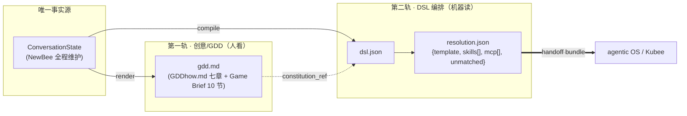

# chat-questioner ↔ agentic OS 通信 GDD 规范（两轨契约）

> 日期：2026-06-04 · 状态：**待用户审阅** · 类型：契约 / 规范（spec）
> 定位：**本文是契约层（接口标准），不是实现细节**。它统领并引用下列权威源，凡细节冲突以本契约为准、以被引文档为实现依据：
> - 第一轨权威源：[`../../GDDhow.md`](../../GDDhow.md)（传统 GDD 七章规范 / 创意方法论）、forgeax `universal_gdd_template.md`（Game Brief 10 节）、[`../prompts/newbee.system.md`](../prompts/newbee.system.md)（NewBee 阶段机 / 收敛输出 [F7]）
> - 第二轨权威源：[`01-设计方案.md`](./01-设计方案.md)（DSL / resolver / 交接契约 §6–§7）、[`07-设计方案-知识库.md`](./07-设计方案-知识库.md)（对话期 RAG，只影响创意发散、不入选型期）
> - 共同事实源：`packages/conversation` 的 `ConversationState`

---

## 1. 定位与两轨模型

chat-questioner 与 agentic OS（forgeax-studio / Kubee）之间的通信，必须同时满足两条**互不替代**的价值线。本契约把它们固化为**两轨**：

| 轨 | 名字 | 管什么 | 失败的样子 | 权威源 |
|---|---|---|---|---|
| **第一轨** | 创意 / GDD 轨 | *做出一个有创新、有灵魂的游戏* —— GDD 怎么写、创新性如何保证 | 产出一份空洞、套模板、没有核心体验的 GDD | `GDDhow.md` · `newbee.system.md` |
| **第二轨** | DSL 编排轨 | *把这个游戏无损地交给 agentic OS 去做* —— 怎么把游戏拆成 DSL 编排 | 信号被静默丢弃 / 半截 DSL / 下游再去搜索读文档 | `01-设计方案.md` §6–§7 |

### 1.1 唯一事实源与交汇点

两轨**共享同一个事实源** `ConversationState`，**唯一交汇点是收敛（Synthesis，阶段 7 / [F7]）**。在收敛点，同一份 state 被**双向投影**成两件产物：



**契约性结论**：

1. GDD 与 DSL **不是先后关系、而是同一 state 的两个投影**。任何一方出现而另一方缺失，即视为不合规交接。
2. 两轨在收敛点**必须同时通过各自的出厂门**（第一轨 §2.3 创新性自检；第二轨 §3.1 完整性 + §3.2 可追溯）才允许导出 bundle。
3. 本契约**不重新设计** DSL/resolver（见 `01`），只把跨两轨的**硬约束、字段映射、交接形状**固化为规范。

---

## 2. 第一轨 · GDD 规范（创意契约）

定义「一份合格、可交接的 GDD」必须满足什么。它有双重身份：**给人看的设计蓝图** + **DSL 的回指源**（`constitution_ref`）。

### 2.1 完整性契约（最小必填章节集）

一份 GDD 在收敛点**至少**必须包含下列章节；缺任一项即「不合格、不可交接」，NewBee 必须回到对应阶段补问（对齐 `newbee.system.md` 阶段机与 [F7]）。下表给出契约项与权威源章节的对应：

| 必填项 | 对齐 `GDDhow.md` | 对齐 Game Brief 10 节 | 由哪个阶段产出 |
|---|---|---|---|
| 一句话 Pitch / 核心体验陈述 | 第一章 1.1 | What | 阶段 1–2 |
| 核心情感（主 / 禁止） | 第一章 1.2 | What | 阶段 2 |
| 核心幻想 / 玩家身份 | 第二章 2.2 | What | 阶段 2 / 5 |
| 核心游戏循环（微 / 中 / 宏） | 第三章 3.1 | How | 阶段 3 |
| 核心机制清单（按优先级） | 第三章 3.2 | How | 阶段 3 |
| 失败 / 胜利规则 | 第三章 3.3 | Win·Lose | 阶段 3 |
| 奖励节奏 | 第六章 6.2 | How / Content | 阶段 4 / 6 |
| 美学 / 手感 / 高光（juice） | 第四章（关卡情绪）· 配 juice | Assets | 阶段 4 |
| 六类关键词池 | （贯穿） | Content | 阶段 1–7 |
| 差异化亮点 + 参考作品（借鉴 / 规避） | 第二章 2.3 | What | 阶段 1 / 7 |
| MVP 范围（必做 / 主动裁剪） | 附录 + 第三章 | MVP | 全程（[F1] 纪律 7） |
| 风险提示（1–3 条） | 附录 C | Risk | 全程（[F1] 纪律 7） |
| **游戏宪法**（不可漂移项清单） | 核心词汇表 + 决策日志 | — | 凡被确认即锁（[F5]） |

> 关卡 / Boss / 系统设计（`GDDhow.md` 第四 / 五 / 七章）为**可选深化项**：MVP 单局玩法类游戏不强求，但一旦 GDD 涉及多关卡 / Boss / 长线系统，则对应章节升为必填。

### 2.2 创新性的来源（接地，不是凭空）

第一轨的创新**必须接地**，不得靠 LLM 凭空编造（这是 `07` 知识库存在的理由）：

- 每轮「动态投喂」的创意应**优先取材 / 改编自检索到的真实设计参考**（标杆游戏 / 机制 / 情绪锚点 / juice / 循环 pattern），无相关参考时才纯现编（见 `07` §7 的 `[F2.5]`）。
- 对话期 RAG 的「模糊召回」**只影响创意发散，绝不进入第二轨选型期**——选型期是确定性、无损、agent 不介入的映射（`07` §1.3）。两个世界严格隔离。

### 2.3 创新性自检（GDD 出厂前必过的硬门）

GDD 在收敛前，必须逐项通过下列自检（收编自 `GDDhow.md` 的 Schell 透镜与自检）；任一项不过则回环补问，**不得带病收敛**：

- [ ] **体验自检（镜头 #2）**：每个核心系统都能回答「玩家在想什么 / 哪个瞬间最满足 / 去掉它核心体验还在吗」。
- [ ] **趣味性自检（镜头 #18）**：每个核心机制至少满足「意外 / 掌控感 / 进步感 / 社交」中的两项。
- [ ] **系统生态自检（镜头 #10）**：无孤立系统、无正反馈死循环、无玩家看不懂的黑箱。
- [ ] **MVP 纪律**：已主动暴露 1–3 条风险，并明确列出「主动裁剪」项；不存在小团队做不完的设想。
- [ ] **防漂移**：所有被用户确认的项均已记入「游戏宪法」，全文术语统一于核心词汇表。

---

## 3. 第二轨 · 无损 DSL 编排（执行契约）

把第一轨的结论无损翻译成 agentic OS 能**精确、零搜索**执行的信号。DSL / resolver 的结构定义见 `01` §6.3–§6.4，本节只固化**两条无损硬约束**——这正是「无损传递」的契约本体。

### 3.1 硬约束 A · 完整性保证（收敛门：信号问全才放行）

> 「只要还有 DSL 必需的工程信号没问清，就回到对应阶段补问，绝不在信息残缺时强行收敛」——`newbee.system.md` [F7] / `01` §8。

- **DSL 必需工程信号**（缺一不可收敛）：`constraints.{platform, dimension, engine, networking, orientation}`、`genre`、`modalities`。这些是 resolver「硬选模板 / 门控 skill·mcp」的输入（`01` 附录 A）。
- **门控时机**：收敛（[F7]）前由引擎做一次 zod 校验（`01` §8「DSL 必填字段缺失」）。校验不过 → 回到对应阶段补问。
- **绝不导出半截 DSL**：校验失败时**不得**输出残缺 `dsl.json`，也**不得**进入 bundle 导出。
- **完整性的可见性**：收敛前 NewBee 以「人话版概念总结」请用户确认（[F7] 九项），这同时是完整性的人侧校验。

### 3.2 硬约束 B · 可追溯保证（零静默丢弃）

> 无损 = 全程可追溯 + 显式记录未命中，取代 agent 的模糊判断（`01` §7.1）。

- **每个被选项必带 `trigger`**：resolution 里每条 `template / skills[] / mcp[] / packages[]` 都必须携带 `trigger`，回溯到**触发它的具体 DSL 信号**（如 `modality:image` / `dimension:2D` / `foundation`）。
- **未命中信号必入 `unmatched`**：任何没有映射到目录的 DSL 信号，必须显式落进 `resolution.unmatched`，**不得静默丢弃**。`unmatched` 为空是「全信号已落地」的证明；非空则进 `warnings` 提示，但仍如实保留。
- **确定性、agent 不介入**：resolver 是纯函数式确定性映射，输出即「加载计划」；`pack-search` 不进 resolution（解析器本身就是它的离线替代）。
- **GDD↔DSL 回指闭环**：`dsl.json.constitution_ref` 必须指向 `gdd.md` 的「游戏宪法」锚点，使第二轨可回查第一轨的不可漂移项。

### 3.3 无损的可执行定义

「无损」在本契约里是**可机器断言**的，等价于以下三条同时成立（对应 `01` §9 的 resolver golden 测试）：

1. **完整**：所有 DSL 必需工程信号非空（§3.1）。
2. **可追溯**：`∀ 被选项 ∃ trigger`，且 `trigger` 指向的 DSL 信号真实存在（§3.2）。
3. **无遗漏**：`unmatched` 完整收录所有未映射信号，`选中信号 ∪ unmatched = DSL 全部可映射信号`。

---

## 4. 两轨之桥 · GDD → DSL 字段映射规范

「无损传递」的字面落点：第一轨 GDD 的哪段表达，被编译进第二轨 DSL 的哪个字段。映射统一遵循 **D7 受控词汇策略：枚举优先 + 自由词回退到 `intent_terms`，绝不丢弃**（`01` D7 / §6.3）。

| GDD / state 来源 | → DSL 字段 | 映射纪律 |
|---|---|---|
| 维度 / 视角、平台、引擎倾向、单机·联网、横竖屏（[F6] 工程信号） | `constraints.*` | 硬枚举，缺失即触发 §3.1 收敛门 |
| 题材 genre | `genre` | 命中枚举入 `genre`；未命中回退 `intent_terms` |
| 核心机制清单（第三章 3.2 / [F6] mechanics） | `mechanics[]` | 同上回退纪律 |
| 美学 / 视听（第二章 2.2 / aesthetic） | `art_style` | 同上回退纪律 |
| 模态需求（要不要图 / 音 / 3D / 像素 / 横版） | `modalities[]` | skill·mcp 门控主开关 |
| 关键词池 + 小白原话（六类池） | `intent_terms[]` | **自由词的安全网**：所有未命中枚举的原话信号汇于此，喂模板加权匹配 |
| 差异化亮点 / 高光爽点（signature / juice） | `signature_terms[]` | 模板加权匹配 |
| MVP 范围（必做 / 裁剪） | `mvp_scope.{must, cut}` | 来自第一轨 MVP 纪律 |
| 游戏宪法锚点 | `constitution_ref` | 回指 `gdd.md#游戏宪法`（§3.2 闭环） |

> **桥的无损性**：本表覆盖 DSL 全部字段；任一 GDD 信号要么命中结构化字段、要么回退 `intent_terms`，**不存在第三条「被丢弃」的去向**。这是 §3.2 可追溯保证在「GDD→DSL」这一段的体现（resolver 侧的 `trigger/unmatched` 则覆盖「DSL→目录」那一段）。

---

## 5. 交接 bundle 契约 + 版本化

### 5.1 bundle 形状

交接给 agentic OS 的产物恒为三件套（`01` §7）：

```text
handoff-bundle/
├── gdd.md           # 第一轨产物（人看 + constitution_ref 源）
├── dsl.json         # 第二轨编译产物（含 schema_version）
└── resolution.json  # resolver 输出（富结构 + install_packs 投影 + unmatched）
```

### 5.2 三档接入与前向兼容

agentic OS 按改造档位消费 `resolution.json`，三档**共用同一 bundle**，不需要 chat-questioner 出多份（`01` §7.1）：

| 档位 | 消费哪部分 | 改造量 | 收益 |
|---|---|---|---|
| 档 1 · 零改造 | 仅 `install_packs` 扁平投影 | ≈0 | 先把对话产出接进来 |
| 档 2 · 短路抓药方 | `template` + `packages` + 投影 | 小（跳过 `pack-search`） | 砍掉搜索 / 读文档损耗 |
| 档 3 · 渐进式分层加载 | 富结构 `skills[]/mcp[]` 的 `layer/phase/load/trigger/tools` | 中（按需门控加载器） | 落地 L0–L5 分层治理 |

### 5.3 版本化规则

- `dsl.json` 与 `resolution.json` 各自带 `schema_version`。
- **兼容变更**（新增可选字段 / resolver 多吐一条带 `layer/phase/trigger` 的条目）→ **不升主版本**，下游无需改造。
- **不兼容变更**（改字段名 / 改语义 / 删字段）→ 升 `schema_version`，并在本契约 §5 记录迁移说明。
- 第一轨 `gdd.md` 不做强 schema 版本，但其「最小必填章节集」（§2.1）变更需同步本契约。

---

## 6. 规范符合性自检清单（Conformance Checklist）

任何一次「chat-questioner → agentic OS」交接，导出 bundle 前必须逐项通过。可直接用作 CI / 导出前断言。

**第一轨（创意 / GDD）**

- [ ] `gdd.md` 覆盖 §2.1 全部最小必填章节（缺项已回环补齐）。
- [ ] §2.3 创新性自检五项全过（体验 / 趣味 / 生态 / MVP / 防漂移）。
- [ ] 创意投喂已接地（取材自真实参考或显式标注纯现编），未向用户泄露知识卡元数据。
- [ ] 全文术语统一于核心词汇表；所有确认项已入「游戏宪法」。

**第二轨（DSL 编排）**

- [ ] §3.1 完整性：DSL 必需工程信号（`constraints.* / genre / modalities`）全部非空，zod 校验通过。
- [ ] §3.2 可追溯：`resolution` 每个被选项均带 `trigger` 且指向真实 DSL 信号。
- [ ] 无遗漏：`unmatched` 完整收录未映射信号；非空项已进 `warnings` 但未丢弃。
- [ ] `dsl.constitution_ref` 指向 `gdd.md#游戏宪法` 锚点（回指闭环）。
- [ ] §3.3 无损三条件可被 resolver golden 测试断言。

**交接 bundle**

- [ ] 三件套齐备（`gdd.md / dsl.json / resolution.json`），且 `dsl/resolution` 含 `schema_version`。
- [ ] `resolution.install_packs` 投影与富结构一致（同一 bundle 支撑三档接入）。
- [ ] 未导出任何半截 DSL（§3.1 校验失败时已阻断导出）。

---

## 7. 开放问题

- 第一轨「最小必填章节集」（§2.1）是否需要按 profile（v1/v3/v4）差异化——例如 v4 潜行挖掘是否放宽某些必填项？建议与 `05` profile 契约一并确认。
- §3.3「无损三条件」是否要落成一个独立的 `assertLossless(bundle)` 工具，纳入 `01` §9 的 golden 测试套件？
- `constitution_ref` 的锚点格式（`gdd.md#游戏宪法` vs 结构化 id 列表）——影响下游能否对单条宪法项做漂移检测。
