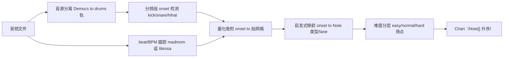

# 技术方案 · 音频鼓点识别与谱面生成（generateChart hook）

> 定位：本文是 `rhythm_game_dsl_spec.md` §5「谱面生成 = hook」的工程实现方案。
> 契约：实现 `note-source.chart = { hook: "generateChart" }` 所指向的 hook，输入音频 → 输出符合 `packages/rhythm/src/types.ts` 的 `Chart`（`Note[]` 按 `time` 升序）。
> 范围：只解决「音频 → 谱面数据」这一段。判定/计分/Combo/Rank 由已落地的规则引擎负责，本文不涉及。
> 给谁看：chat-questioner 侧负责接线 `generateChart` 的 agent / 工程。

---

## 0. 一句话结论

谱面生成不是单一算法，而是一条**离线预处理流水线**：
`音源分离 → 分频段 onset 检测 → beat/BPM 跟踪 → 量化吸附 → 启发式映射成 Note → 难度分层`。
业界（MIR 领域）这套已经非常成熟，**不要自己从零写信号处理**，用现成库做检测，自己只写「检测结果 → Note 映射」这一层（这层才是音游的护城河，对齐 spec §5）。

---

## 1. 先厘清两件不同的事

谱面生成里混着两个独立问题，必须分开处理，否则 note 会又密又抖：

| 概念 | 解决什么 | 产出 | 对应 Note 字段 |
|---|---|---|---|
| **Onset detection（音符起始检测）** | 「有声音敲下来」的瞬间在哪 | 一串时间戳 + 强度 | `note.time` 的候选 |
| **Beat / tempo tracking（节拍跟踪）** | 稳定的节奏网格（BPM、拍点）在哪 | BPM + 拍点序列 | `chart.bpm` + 量化网格 |

落地做法：**onset 为主**（决定打哪），**beat 为辅**（把 onset 吸附到拍网格，去抖、去碎）。

---

## 2. 业界成熟方案选型

MIR（Music Information Retrieval）领域的现成工具，按「原型 → 生产」两档选：

| 库 | 语言 | 能力 | 适用阶段 | 备注 |
|---|---|---|---|---|
| **librosa** | Python | `onset_detect` / `beat_track` / `onset_strength` | 原型首选 | 基于 spectral flux，API 最顺手 |
| **aubio** | C（含 Py/JS 绑定） | onset / tempo 实时检测 | 性能敏感场景 | 很多节奏工具底层用它 |
| **madmom** | Python（深度学习） | RNN/TCN beat & downbeat tracking | 生产级精度 | 当前 beat 跟踪精度最高，依赖重、慢 |
| **Essentia** | C++/Py（含 WASM） | 全套 MIR + 浏览器可跑 | 需前端推理时 | Spotify 系 |
| **Demucs / Spleeter** | Python | 音源分离（抽出 drums 轨） | 质量关键招 | 先分离鼓轨再检测，抗干扰大幅提升 |

参考实践：StepMania 自动谱面的 Dance Dance Convolution 论文、osu! 系 mapping 工具，走的都是「onset + beat 量化 + 启发式映射」这条路。

---

## 3. 推荐流水线（generateChart 的内部步骤）



### 3.1 步骤拆解

1. **音源分离（可选但强烈建议）**：用 Demucs 把混音拆出 `drums` 轨。对纯鼓轨做 onset，远比对混音做准。算力不够时可跳过，直接对原曲做。
2. **分频段 onset 检测**：对低频段（kick）、中频（snare）、高频（hihat）**分别**检测 onset。这是单纯整轨 onset 做不到的关键——能区分打击类型，自然映射到不同 `lane`。
3. **beat / BPM 跟踪**：得到全曲 `bpm` 与拍点序列，构建 1/4、1/8、1/16 拍网格。
4. **量化吸附**：把每个 onset 吸附到最近的网格点，丢弃偏离过大的孤点；这是去抖、让谱面踩得上拍的核心。
5. **启发式映射**：把量化后的 onset 翻译成 `Note`（见 §4）。
6. **难度分层**：同一组 onset，按密度阈值筛出 easy/normal/hard 三套（见 §5）。

### 3.2 输出对齐契约

最终产出必须是 `packages/rhythm/src/types.ts` 的 `Chart`：

```ts
interface Chart {
  songId: string;
  bpm: number;          // 来自 §3.1 step 3
  durationMs: number;   // 音频总长
  difficulty: "easy" | "normal" | "hard";
  laneCount: number;    // 与 track-layout.lanes 一致
  notes: Note[];        // 按 time 升序
}
```

---

## 4. onset → Note 的启发式映射（护城河层）

这是唯一需要自己写的核心逻辑，对齐 `rhythm_game_core_rules.md` §5「波形 → note 类型」规则：

| 音频特征 | Note 映射 | 依据 |
|---|---|---|
| 频段（kick/snare/hihat） | `note.lane`（低频 to lane0，依次类推） | 分频段检测的直接产物 |
| 孤立强 onset（单峰） | 单个 `tap` | 核心规则「波形单峰 to 点按」 |
| 持续能量段（音符延音） | `hold`，`duration` = 段长 | 「高潮区混排 hold」 |
| 节奏走向突变 / 段落切换 | `flick`，`dir` 按情绪给 | 「音阶拐点 to 方向滑动」 |
| 高潮区（能量峰 + onset 密集） | `hold` + 高频 `tap` 混排 | 「高潮区操作密度突增」 |
| 普通密集段 | 连续 `tap` | 「连续起伏 to 连续点按」 |

映射时的工程约束：
- **限流**：相邻 note 设最小间隔（如 ≥ 80ms），避免同 lane 连击不可玩。
- **按强度筛**：onset strength 低于阈值的弱拍丢弃，保证每个 note 有音乐依据。
- **flick 方向**是硬约束（spec §6.3），映射时要给确定的 `dir`。

---

## 5. 难度分层

同一首曲子共享同一组 onset 候选，按密度差异化筛选（对齐核心规则 §5「难度调节维度」）：

| 难度 | 筛点策略 | laneCount 倾向 |
|---|---|---|
| easy | 只保留强拍（onset strength top 段）+ 大最小间隔 | 少（如 2） |
| normal | 保留主要 onset，中等间隔 | 中（如 4） |
| hard | 全量 onset + flick/hold/特殊 + 小间隔 | 多（如 4~6） |

---

## 6. 工程落地建议

- **离线生成，不要运行时实时算**：在选歌/上传时算好谱面并缓存，运行时引擎只消费 `Chart`。Demucs + madmom 都太重，不能放进帧循环。
- **服务化**：把流水线做成一个 Python 微服务 / 离线 job（输入音频，输出 `chart.json`）。chat-questioner 是 TS monorepo，`generateChart` hook 在 TS 侧只负责**调用该服务 + 校验输出**，不在 Node 里跑信号处理。
- **hook 形态对齐 spec**：`note-source.chart = { hook: "generateChart" }`，引擎加载期调用 hook 拿 `Chart`。hook 可先返回手写谱面（验证引擎），再切到算法产出（spec §5 渐进路线：手写 to 算法 to 音频分析）。
- **可复现**：固定库版本与随机种子，保证同一音频每次产出同一 `Chart`（便于 golden 测试，对齐 spec §7）。

---

## 7. 落地路线（对齐 spec §5 / §7 的渐进式）

1. **P0 手写谱面** → verify：`neonPulseChart` 已存在，引擎跑通判定/计分。
2. **P1 算法骨架（无音频）**：输入 BPM + 难度 → 按启发式铺规则网格 note → verify：产出 `Chart` 通过 `validate`、`Note[]` 升序、最小间隔达标。
3. **P2 接入 onset 检测**：librosa 原型，整轨 onset → 量化 → 映射 → verify：人工对 3~5 首曲子听感，note 踩在鼓点上。
4. **P3 分离 + 分频段 + 难度分层**：Demucs + 分频段 + madmom → verify：kick/snare 分轨正确、三档难度密度递增、可复现。

---

## 8. 给下游 agent 的接口约定（建议）

```ts
// generateChart hook 期望签名（TS 侧）
interface GenerateChartInput {
  audioUrl: string;                 // 音频来源
  songId: string;
  difficulty: "easy" | "normal" | "hard";
  laneCount: number;                // 与 track-layout.lanes 一致
}
// 返回 packages/rhythm 的 Chart，notes 按 time 升序
type GenerateChart = (input: GenerateChartInput) => Promise<Chart>;
```

约定要点：
- hook **只产 `Chart`**，不碰判定/计分。
- `bpm` / `durationMs` 由流水线测得回填，不要让上游瞎填。
- 输出前在 hook 内做一次 `validate`（升序、字段完整、flick 必带 dir、hold 必带 duration），脏数据不进引擎。
